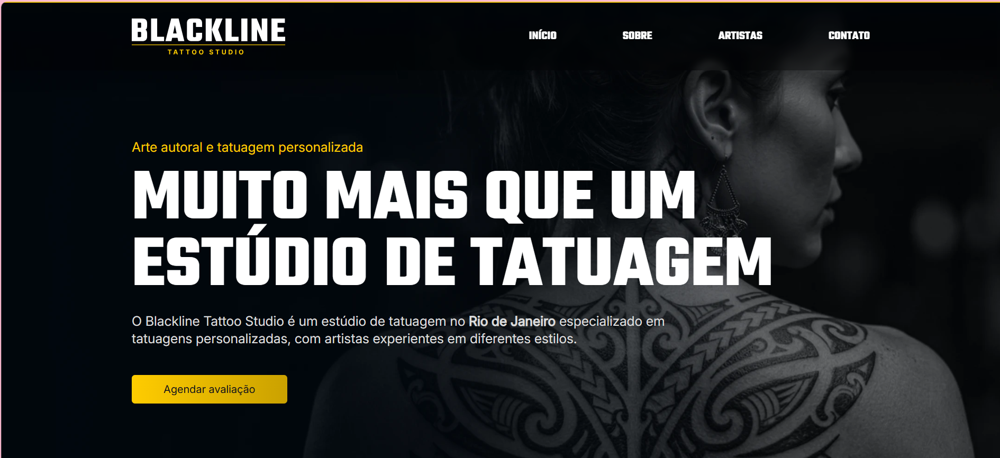

ProjetoStudioTatuagem

Projeto Front-End responsivo desenvolvido com HTML5, CSS3 e JavaScript, baseado em um layout criado no Figma.

O objetivo do projeto foi praticar:

Estruturação semântica HTML
Responsividade
Fidelidade ao layout do Figma
Organização de código
Animações com GSAP
Experiência do usuário (UI/UX)
🚀 Tecnologias Utilizadas
HTML5
CSS3
JavaScript
GSAP Animation
Figma
📱 Responsividade

O projeto foi desenvolvido pensando em adaptação para diferentes dispositivos:

Desktop
Tablet
Mobile
✨ Funcionalidades
Menu responsivo
Animações suaves com GSAP
Layout moderno
Estrutura organizada
Seções interativas
Fidelidade visual ao protótipo do Figma
🎯 Objetivo do Projeto

Esse projeto foi desenvolvido durante meus estudos de Front-End na Coti Informática com o objetivo de praticar desenvolvimento web moderno e transformação de layouts do Figma em aplicações reais.

📸 Preview do Projeto

